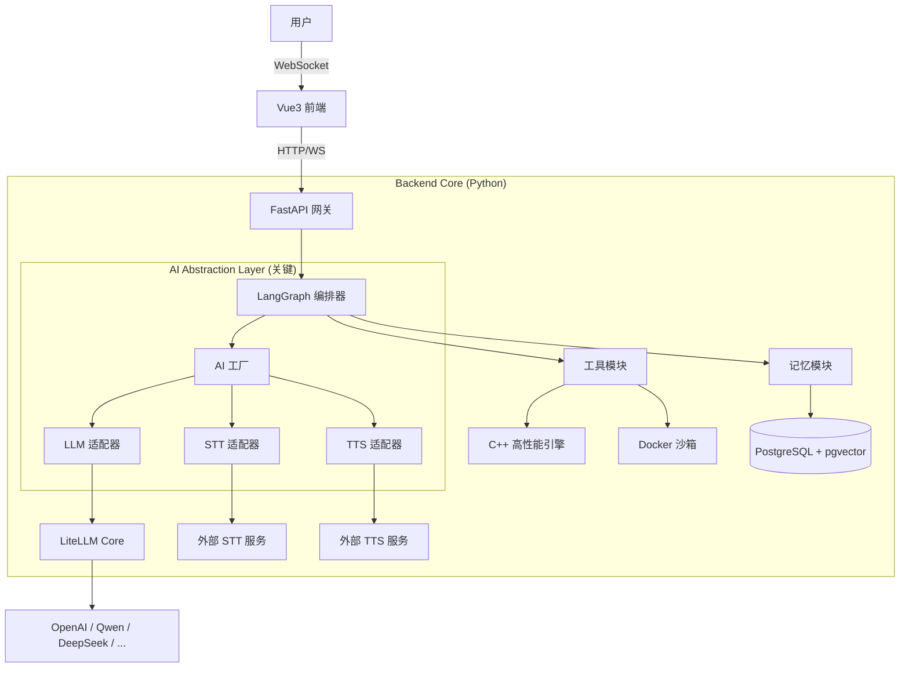
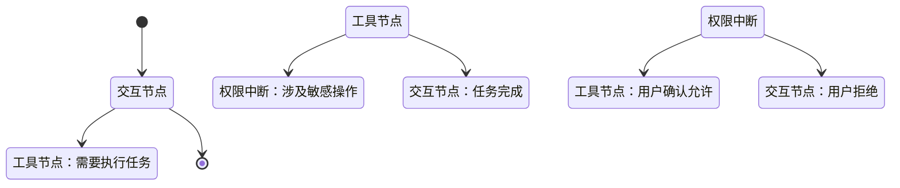

# SmartBot 系统架构设计文档

## 1. 概述 (Overview)

本系统旨在构建一个**高性能、高可扩展、安全**的通用 AI Agent 平台。架构核心思想是**“逻辑与执行分离”**、**“模型与业务解耦”**。通过 Python 实现灵活的 Agent 编排，C++ 处理高性能计算，Vue3 提供富交互前端，并利用抽象层屏蔽底层 AI 模型差异，实现模型的无缝切换与扩展。

### 1.1 设计原则
1.  **抽象优先 (Abstraction First)**：所有 AI 能力（LLM, STT, TTS）必须通过标准接口访问，禁止业务逻辑直接依赖具体 SDK。
2.  **流式驱动 (Streaming Native)**：全链路支持流式数据传输（文本/音频），确保低延迟交互体验。
3.  **状态可管 (State Management)**：使用状态机管理 Agent 执行流程，支持中断、恢复、权限确认。
4.  **安全沙箱 (Secure Sandbox)**：所有代码执行与系统操作必须在隔离环境中进行。

---

## 2. 技术栈选型 (Technology Stack)

| 模块 | 技术选型 | 理由 |
| :--- | :--- | :--- |
| **后端核心** | Python 3.10+ | 生态丰富，适合 AI 逻辑编排 |
| **高性能组件** | C++ / pybind11 | 处理图像、音频、高并发 IO，通过 Python 调用 |
| **Agent 编排** | **LangGraph** | 支持多 Agent 协作、状态机、人工介入 (Human-in-the-loop) |
| **模型抽象** | **LiteLLM** + 自定义适配层 | 统一 100+ 模型接口，支持动态切换，防止厂商锁定 |
| **API 服务** | **FastAPI** | 高性能异步框架，原生支持 WebSocket |
| **前端交互** | **Vue 3** + Vite + Pinia | 响应式 UI，组件化开发，生态成熟 |
| **数据存储** | **PostgreSQL** + pgvector | 关系型数据 + 向量检索，统一存储架构 |
| **执行沙箱** | Docker SDK | 隔离 AI 代码执行环境，保障宿主机安全 |
| **语音处理** | Web Audio API + WebSocket | 前端原生音频处理，低延迟流式传输 |

---

## 3. 系统架构设计 (System Architecture)

### 3.1 整体架构图



### 3.2 核心模块职责

1.  **AI 抽象层 (AI Abstraction Layer)**: 
    *   定义标准接口 (`LLMProvider`, `STTService`, `TTSService`)。
    *   实现工厂模式，根据配置动态加载具体提供商（如 OpenAI, Qwen）。
    *   **目的**：业务代码不感知具体模型，更换模型只需修改配置。
2.  **Agent 编排器 (Orchestrator)**:
    *   基于 LangGraph 构建状态机。
    *   管理双 Agent 模式（交互 Agent + 工具 Agent）。
    *   处理权限中断 (`interrupt_before`) 和状态恢复。
3.  **工具模块 (Tools)**:
    *   封装 C++ 模块为 Python Tool。
    *   管理 Docker 沙箱生命周期。
4.  **记忆模块 (Memory)**:
    *   短期记忆（Redis/内存）：会话上下文。
    *   长期记忆（Postgres）：向量检索、经验总结、历史归档。

---
## 4. AI 抽象层设计 (AI Abstraction Layer Design)

本层是系统的**核心解耦层**，旨在屏蔽底层 AI 模型（LLM, STT, TTS, Vision）的差异，支持多模态交互，并提供运行时能力检查与降级机制。所有上层业务逻辑（Agent 编排、工具调用）仅依赖本层定义的标准接口，不直接依赖任何厂商 SDK。

### 4.1 设计目标

1.  **多模态支持**：统一处理文本、图像、音频、视频、文件等多种内容类型。
2.  **能力声明**：每个模型必须声明其支持的能力（如是否支持流式、视觉、函数调用），便于运行时检查。
3.  **向后兼容**：保留纯文本交互的简洁性，旧代码无需修改即可运行。
4.  **动态扩展**：新增模型提供商只需实现标准接口并注册，无需修改核心业务逻辑。
5.  **流式原生**：所有接口默认支持流式传输，保障低延迟体验。

### 4.2 核心数据模型 (Core Data Models)

#### 4.2.1 内容块 (ContentBlock)
支持多模态内容的最小单元。

```python
from typing import Literal, Optional, Dict, Any
from pydantic import BaseModel

class ContentType(str, Enum):
    TEXT = "text"
    IMAGE = "image"
    AUDIO = "audio"
    VIDEO = "video"
    FILE = "file"
    TOOL_CALL = "tool_call"
    TOOL_RESULT = "tool_result"

class ContentBlock(BaseModel):
    type: ContentType
    data: str                      # 文本 / Base64 / URL
    mime_type: Optional[str] = None  # 如 "image/png"
    metadata: Optional[Dict[str, Any]] = None
```

#### 4.2.2 消息结构 (Message)
兼容纯文本和多模态列表。

```python
from typing import List, Union, Literal
from pydantic import BaseModel

class Message(BaseModel):
    role: Literal["system", "user", "assistant", "tool"]
    content: Union[str, List[ContentBlock]]  # 兼容 str 和 List[ContentBlock]
    tool_call_id: Optional[str] = None
    tool_calls: Optional[List[Dict]] = None
    
    # 快捷构造方法
    @classmethod
    def text(cls, role: str, content: str, **kwargs) -> "Message":
        return cls(role=role, content=content, **kwargs)
    
    @classmethod
    def multi_modal(cls, role: str, blocks: List[ContentBlock], **kwargs) -> "Message":
        return cls(role=role, content=blocks, **kwargs)
```

#### 4.2.3 模型能力声明 (ModelCapability)
用于运行时检查模型是否支持特定功能。

```python
class ModelCapability(BaseModel):
    supports_text_input: bool = True
    supports_image_input: bool = False
    supports_audio_input: bool = False
    supports_function_calling: bool = False
    supports_streaming: bool = True
    max_context_tokens: Optional[int] = None
    supported_image_formats: List[str] = ["image/jpeg", "image/png"]
    # ... 其他能力字段
```

### 4.3 服务接口定义 (Service Interfaces)

所有 AI 服务必须实现以下抽象基类 (ABC)。

#### 4.3.1 LLM 服务接口

```python
from abc import ABC, abstractmethod
from typing import AsyncGenerator, List

class LLMProvider(ABC):
    @abstractmethod
    async def get_capability(self) -> ModelCapability:
        """返回模型能力声明"""
        pass
    
    @abstractmethod
    async def chat(self, messages: List[Message], **kwargs) -> Message:
        """非流式对话"""
        pass
    
    @abstractmethod
    async def stream_chat(self, messages: List[Message], **kwargs) -> AsyncGenerator[ContentBlock, None]:
        """流式对话，yield ContentBlock"""
        pass
    
    @abstractmethod
    async def validate_messages(self, messages: List[Message]) -> bool:
        """预检查消息是否符合模型能力"""
        pass
```

#### 4.3.2 语音服务接口 (STT/TTS)

```python
class STTService(ABC):
    @abstractmethod
    async def get_capability(self) -> ModelCapability: pass
    
    @abstractmethod
    async def transcribe(self, audio_data: bytes, **kwargs) -> str: pass
    
    @abstractmethod
    async def stream_transcribe(self, audio_stream: AsyncGenerator[bytes, None], **kwargs) -> AsyncGenerator[Dict, None]:
        """yield {"text": str, "is_final": bool, ...}"""
        pass

class TTSService(ABC):
    @abstractmethod
    async def get_capability(self) -> ModelCapability: pass
    
    @abstractmethod
    async def list_voices(self) -> List[Dict]: pass
    
    @abstractmethod
    async def stream_speak(self, text: str, voice_id: str, **kwargs) -> AsyncGenerator[bytes, None]:
        """yield 音频二进制块"""
        pass
```

#### 4.3.3 视觉服务接口 (Vision)

```python
class VisionService(ABC):
    @abstractmethod
    async def get_capability(self) -> ModelCapability: pass
    
    @abstractmethod
    async def analyze_image(self, image_data: bytes, prompt: str, **kwargs) -> str:
        """图片理解"""
        pass
```

### 4.4 工厂与能力管理 (Factory & Capability Management)

通过工厂模式管理服务实例，并提供能力检查机制。

```python
# backend/core/ai_factory.py
class AIFactory:
    _registry = {
        "llm": {},
        "stt": {},
        "tts": {},
        "vision": {}
    }
    
    @classmethod
    def register(cls, service_type: str, provider_name: str, adapter_class):
        """注册服务提供商"""
        cls._registry[service_type][provider_name] = adapter_class
    
    @classmethod
    def get_service(cls, service_type: str, provider_name: str, config: dict):
        """获取服务实例"""
        return cls._registry[service_type][provider_name](**config)
    
    @classmethod
    async def check_capability(cls, service_type: str, provider_name: str, required: ModelCapability) -> bool:
        """检查模型是否满足所需能力"""
        service = cls.get_service(service_type, provider_name, {})
        capability = await service.get_capability()
        # 实现逻辑检查 required 是否被 capability 覆盖
        return True 
```

### 4.5 扩展指南 (Extension Guide)

当需要接入新模型（如新的 Qwen 版本或其他厂商）时，遵循以下步骤：

1.  **新建适配器**：在 `backend/adapters/` 下创建新文件，继承对应接口（如 `LLMProvider`）。
2.  **实现接口**：内部调用新模型 SDK，转换为标准 `Message` 和 `ContentBlock`。
3.  **实现能力声明**：在 `get_capability()` 中准确返回模型支持的功能。
4.  **注册**：在初始化代码中调用 `AIFactory.register()`。
5.  **配置**：在数据库 `agent_profiles` 中添加新配置记录。
6.  **完成**：**无需修改任何 Agent 业务逻辑代码**。


### 4.7 关键设计原则总结

| 原则       | 说明                                           |
| :------- | :------------------------------------------- |
| **接口隔离** | 业务逻辑只依赖 `core/ai_interfaces.py`，不依赖具体厂商 SDK。 |
| **能力驱动** | 通过 `ModelCapability` 在运行时决定能否使用某功能，避免硬编码判断。  |
| **流式优先** | 所有接口默认提供 `stream_` 方法，保障实时交互体验。              |
| **优雅降级** | 当模型能力不足时（如不支持图片），工厂层可自动切换模型或调用 Vision 服务辅助。  |
| **向后兼容** | `Message.content` 支持 `str`，旧代码无需重构即可运行。      |
 
---

## 5. Agent 编排设计 (Agent Orchestration)

### 5.1 双 Agent 模式

*   **交互 Agent (Interaction Agent)**:
    *   **职责**: 对话、情感交流、意图识别。
    *   **模型**: 可选用低成本、高响应速度的模型。
    *   **工具**: 仅允许调用 `delegate_task`。
*   **工具 Agent (Tool Agent)**:
    *   **职责**: 任务规划、代码执行、工具调用。
    *   **模型**: 可选用高逻辑、强代码能力的模型。
    *   **工具**: 允许调用所有系统工具（需权限确认）。

### 5.2 状态机与中断 (State & Interrupt)

利用 LangGraph 的 `checkpoint` 和 `interrupt_before` 机制处理权限申请。



*   **权限中断**: 当检测到敏感操作（如删除文件、联网），Graph 进入 `interrupt` 状态。
*   **前端交互**: 前端收到 `permission_request` 事件，弹窗确认。
*   **恢复执行**: 用户确认后，后端调用 `graph.update_state`，Graph 从断点继续执行。

---

## 6. 语音交互流水线 (Voice Pipeline)

全链路流式设计，确保低延迟。

1.  **前端录音**: `MediaRecorder` 分片采集音频 (Opus/WebM)。
2.  **WebSocket 传输**: 音频块实时推送到后端。
3.  **STT 流式识别**: 后端接收音频 -> 调用 STT 服务 -> 返回 `interim` (中间) 和 `final` (最终) 文本。
4.  **LLM 流式生成**: 收到 `final` 文本 -> 触发 LLM -> 流式返回文本块。
5.  **TTS 流式合成**: 收到文本块 -> 触发 TTS -> 流式返回音频块。
6.  **前端播放**: `Web Audio API` 接收音频块 -> 缓冲播放。

**关键优化**:
*   **打断 (Barge-in)**: 前端检测到用户再次说话，立即发送 `interrupt` 信号，后端停止 TTS 流并清空 LLM 上下文。
*   **VAD**: 集成语音活动检测，自动判断说话结束，减少延迟。

---

## 7. 性能与安全 (Performance & Security)

### 7.1 C++ 高性能模块
*   **场景**: 屏幕截图、OCR 识别、音频预处理、高并发消息队列。
*   **集成**: 使用 `pybind11` 编译为 `.so`/`.pyd`，在 Python 中作为普通函数调用。
*   **GIL 管理**: C++ 耗时操作必须释放 GIL (`py::gil_scoped_release`)，避免阻塞 Python 主线程。

### 7.2 隔离执行环境 (Sandbox)
*   **技术**: Docker Container。
*   **策略**:
    *   每个任务创建临时容器，执行完毕后销毁。
    *   限制资源：CPU quota, Memory limit。
    *   网络隔离：默认禁用外网，仅允许通过代理访问特定 API。
    *   文件系统：只挂载 `/workspace`，禁止访问宿主机敏感目录。

---

## 8. 数据模型设计 (Data Model)

### 8.1 核心表结构 (PostgreSQL)

```sql
-- Agent 配置表 (支持动态切换)
CREATE TABLE agent_profiles (
    id UUID PRIMARY KEY,
    name VARCHAR(50),
    system_prompt TEXT,
    provider_type VARCHAR(50),  -- 如 'litellm', 'qwen_realtime'
    model_name VARCHAR(100),    -- 如 'gpt-4o', 'qwen-turbo'
    allowed_tools JSONB
);

-- 会话记忆表 (支持向量检索)
CREATE TABLE chat_messages (
    id UUID PRIMARY KEY,
    session_id UUID,
    role VARCHAR(20),
    content TEXT,
    embedding VECTOR(1536),     -- pgvector
    created_at TIMESTAMP
);

-- 任务执行日志 (审计用)
CREATE TABLE task_logs (
    id UUID PRIMARY KEY,
    session_id UUID,
    tool_name VARCHAR(50),
    input_params JSONB,
    output_result TEXT,
    permission_status VARCHAR(20), -- granted, denied
    created_at TIMESTAMP
);
```

---

## 9. 部署与扩展 (Deployment & Extension)

### 9.1 目录结构建议
```text
project_root/
├── backend/
│   ├── core/               # AI 抽象层 (Interfaces, Factory)
│   ├── agents/             # LangGraph 定义 (Nodes, State)
│   ├── tools/              # 工具实现 (Python + C++ wrappers)
│   ├── voice/              # 语音流水线 (STT, TTS adapters)
│   ├── api/                # FastAPI 路由
│   └── main.py
├── cpp_lib/                # C++ 源码
├── frontend/               # Vue3 源码
├── docker/                 # 沙箱镜像配置
└── config/                 # 模型提供商配置 (YAML/DB)
```

### 9.2 扩展检查清单
当引入新能力时，检查以下点：
- [ ] **AI 模型**: 是否实现了 `LLMProvider` 接口？是否在 Factory 注册？
- [ ] **工具**: 是否封装为 LangChain `@tool`？是否经过安全审查？
- [ ] **语音**: STT/TTS 是否支持流式？是否适配了统一接口？
- [ ] **前端**: 是否通过 WebSocket 事件解耦？是否适配了新的事件类型？
- [ ] **配置**: 是否可以通过数据库/配置文件生效，而无需重新编译代码？

---

## 10. 总结

本架构通过**分层抽象**和**流式编排**，实现了业务逻辑与底层 AI 能力的彻底解耦。
*   **短期收益**：快速集成主流模型（OpenAI, Qwen, DeepSeek），实现语音对话和工具调用。
*   **长期收益**：当新模型或新硬件出现时，只需编写适配器插件，核心业务代码无需改动，极大降低了技术债务和维护成本。

**核心口号**：**配置驱动模型，接口屏蔽差异，流式保障体验。**